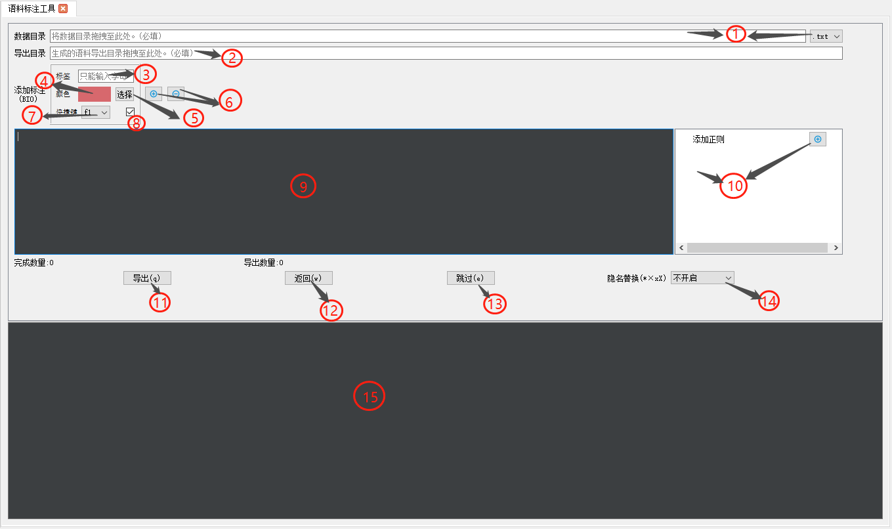
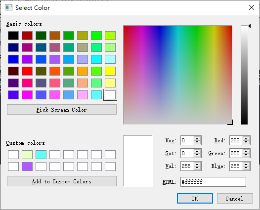
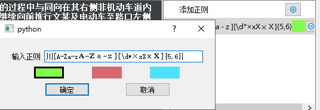

# nlp tools 

### 语料标注工具


* 标签说明
    ```
    标记1  数据目录和文件类型选择    
    标记2  导出目录     
    标记3  标签
    标记4  标注颜色与单击标注       
    标记5  选择颜色     
    标记6  增加和减少标签         
    标记7  标注快捷键选择           
    标记8  是否输出
    标记9  语料标注与编辑
    标记10 添加与标注相关的正则
    标记11 导出一条语料
    标记12 返回至上一条
    标记13 跳过当前这条语料
    标记14 隐名替换(包含隐名的标注)
    标记15 log输出
    ```
* `标记1`   数据目录和文件类型选择 
    ```
    a. 将要标注的语料文件夹拖拽至输入框
    b. 目前只支持.txt结尾的文本文件
    c. 工具只读取根目录下的所有文本文件，子目录不读取
    ```   
* `标记2`   导出目录    
    ```
    a. 建立一个导出文件夹，将文件夹拖拽至输入框
    b. 所有语料都会导入到一个文本文件中，重新拖拽数据目录到'标记1'中将会生成一个新的导出语料文本文件。
    c. 导出语料的文本文件将遵从格式<p>...<span class="your mark" style="color:<your color>">...</span>...</p>
    ```
* `标记3`   标签    
    
    
    ```
    a. 标签文本使用英文编辑
    b 被标注的文本遵从格式<span class="your mark" style="color:<your color>">...</span>
    ```
* `标记4`   标注颜色与单击标注    
    ```
    a. 单击此处将会标注'标记9'中的高亮文本
    ```
* `标记5`   选择颜色    
    
    ```
    a. 选中的颜色将会成为标签的颜色
    b '标记11'中文本颜色为白色,选择颜色若为#ffffff,工具会将颜色替换为#d7686d
    ```
* `标记6`   增加和减少标签  
     
    ```
    a. 减少或增加一个标签
    b. 不能设置相同颜色和相同的标签文本，若设置相同参数，无法标注。
    ``` 
* `标记7`   标注快捷键选择    
    ```
    a. 快捷键范围是F1~F12
    b. 单击快捷键将会标注'标记9'中的高亮文本
    ```
* `标记8`   是否输出    
    ```
    a. 若不打勾，标记的文本将不会输出
    b. 默认为打勾状态
    c. 不输出的状态可用于语料为'<p>...<span class="your mark" style="color:<your color>">...</span>...</p>'格式时，为其中'span'
    的文字自动打上标注，不输出却可以起到提示作用。
    ```
* `标记9`   语料标注与编辑
    ```
    a. 输出格式为'<p>...<span class="your mark" style="color:<your color>">...</span>...</p>'
    b. 若语料格式为'<p>...<span class="your mark" style="color:<your color>">...</span>...</p>'，必须在标签栏中创建对应
    'span class'的中的标签，否则无法进行标注。
    c. 支持无格式文本和'b'中描述格式，两种格式
    ```    
    * 支持编辑和撤回文本，撤回快捷键为"ctrl+z"

    * 例如有语料:
    
        `<p>今天<span class="LOC" style="color:#38ff38">福州</span>很炎热，<span class="PER" style="color:#ffbd39">马女士</span>不出门</p>`
    
        在工具中的体现将会是:
         
        ```
        如图所示，我选择LOC标签输出，PER标签不输出，这里'标记8'起到了一个去杂的作用，输出的语料将会是：
        <p>今天<span class="LOC" style="color:#38ff38">福州</span>很炎热，马女士不出门</p>
        ```
    * 右键'标记9'出现常用插入选项
     
    
* `标记10`  添加与标注相关的正则
    * 插入正则时需要选中正则对应的标签，工具会通过正则将语料中匹配的文字打上标签，例如：
         
        点击`确定`后:
        
        `双击`正则可以重新编辑:
        
        
    
        点击`减号`图标可删除该条正则
        
        
    * 使用'waste'标签搭配正则完成去杂功能
        ```
        在标签栏中创建一个值'waste',颜色独立,快捷键独立的标签。
        ```
        
        ```
        在正则栏中新增一条与'waste'关联的正则，例如：
        ```
        
        创建成功后如图所示：
        
         
* `标记11`  导出一条语料    
    ```
    a.可以使用快捷键'alt+q'导出一条数据
    b.可以单击'标记11'导出一条数据
    ```
    * 导出数据将会使完成数量和导出数量分别+1
    
        
    * 导出数据log
        
* `标记12`  返回至上一条  
    ```
    a.删除导出文件中最后一条语料
    b.返回至上一条编辑的语料
    c.若上一条语料是被跳过的，完成数量-1
    d.若上一条语料是导出的，导出数据将会使完成数量和导出数量分别-1
    ```  
* `标记13`  跳过当前这条语料    
    ```
    a.完成数量+1
    b.当前语料不会被
    ```
    * 跳过log
    
* `标记14`  隐名替换(包含隐名的标注)  
    ```
    a.若标注中出现'*×xXｘＸ'此类隐名含义的字符，可以开启隐名替换，将隐名字符随机替换成数字、字母、下划线。
    b.默认不开启
    ```  
    
* `标记15`  log输出   
     